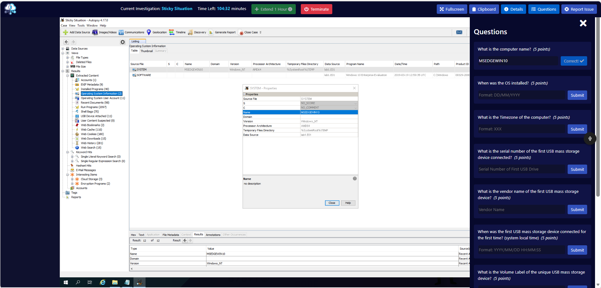
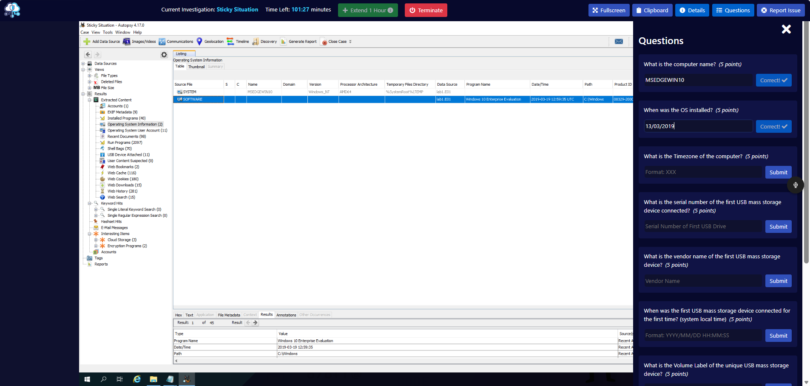
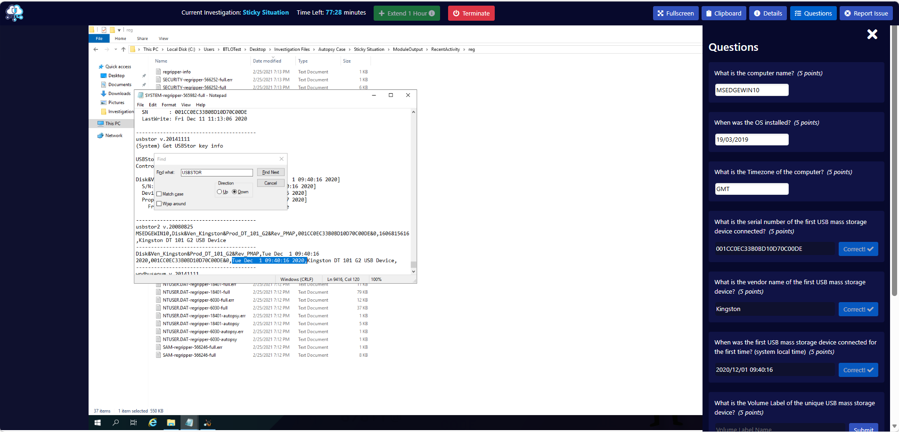
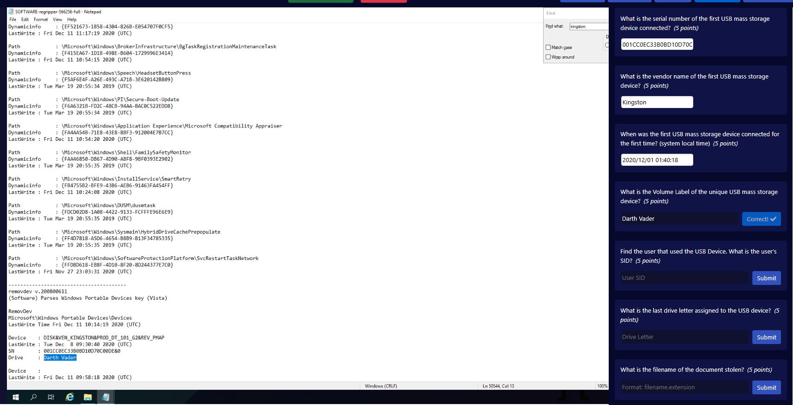
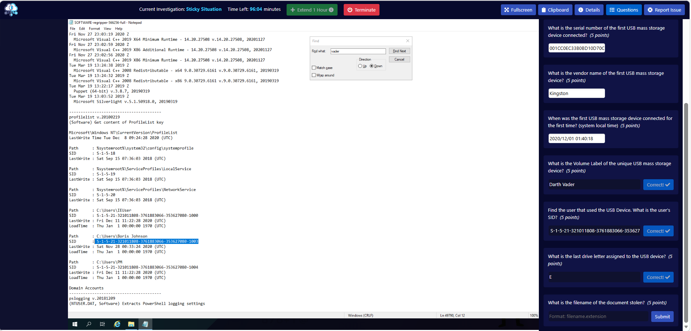
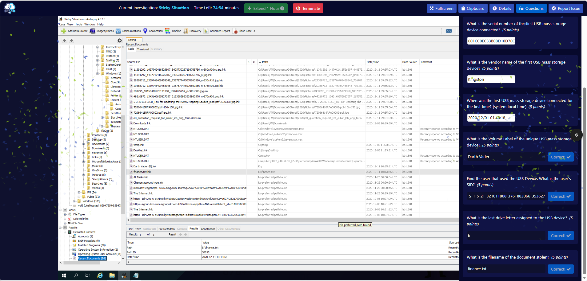

# Sticky Situation — BTLO Investigation Writeup

**Platform:** Blue Team Labs Online (Retired Investigation)  
**Difficulty:** Medium  
**Category:** Digital Forensics  
**Tools Used:** Autopsy, Windows Registry (Regripper output)  
**MITRE ATT&CK:** T1052.001 — Exfiltration over Physical Medium: Exfiltration via USB

---

## Scenario

A highly confidential document has been stolen from the President's laptop and sold on the Dark Web. The Secret Service believes someone with physical access to the laptop used a USB device to retrieve the document. The task is to identify the device used, who used it, and what was taken.

---

## Setup

The disk image (`lab1.E01`) is pre-loaded into an Autopsy case located at:

`C:\Users\BTLOTest\Desktop\Investigation Files\Autopsy Case\Sticky Situation\`

Autopsy also exports processed registry output to:

`C:\Users\BTLOTest\Desktop\Investigation Files\Autopsy Case\Sticky Situation\ModuleOutput\RecentActivity\reg\`

These exported files are essential for questions that Autopsy's GUI cannot answer directly.

---

## Investigation

### Question 1 — What is the computer name?

Navigated to **Results → Extracted Content → Operating System Information** in Autopsy. Clicked the SYSTEM row and viewed the Name field in the properties panel.

**Answer: `MSEDGEWIN10`**

---

### Question 2 — When was the OS installed?

In the same Operating System Information section, clicked the SOFTWARE row. The Date/Time column showed the installation timestamp.

**Answer: `13/03/2019`**

---

### Question 3 — What is the timezone of the computer?

Autopsy's GUI does not display timezone information directly. The timezone is stored in the Windows registry under `HKLM\SYSTEM\CurrentControlSet\Control\TimeZoneInformation`.

Opened the Regripper output file at:
`ModuleOutput\RecentActivity\reg\SYSTEM-regripper-565982-full`

Searched for `TimeZoneKeyName` to locate the timezone value.

**Answer: `GMT`**

---

### Question 4 — What is the serial number of the first USB mass storage device connected?

Autopsy's USB Device Attached section shows last connection timestamps, not first connection times — this is a known limitation that can lead to incorrect answers if relied upon alone.

Opened `SYSTEM-regripper-565982-full` and searched for `USBSTOR`. This revealed the Kingston DT 101 G2 device with a first connection date of **Tue Dec 1 09:40:16 2020** — earlier than any other storage device in the list.

**Answer: `001CC0EC33B0BD10D70C00DE`**

> **Note:** The Autopsy GUI timestamps reflect last write time, not first connection. Always verify USB first connection times using the USBSTOR registry key or setupapi.dev.log.

---

### Question 5 — What is the vendor name of the first USB mass storage device?

Found in the same USBSTOR registry entry. The device string showed `Ven_Kingston`.

**Answer: `Kingston`**

---

### Question 6 — When was the first USB mass storage device connected for the first time (system local time)?

The USBSTOR registry entry confirmed the first connection time for the Kingston device.

**Answer: `2020/12/01 09:40:16`**

---

### Question 7 — What is the Volume Label of the unique USB mass storage device?

Volume labels are stored in the SOFTWARE registry hive under the Portable Devices key. Opened `SOFTWARE-regripper-566256-full` and searched for `Devices`. Located the Kingston device entry which included the Drive label.

**Answer: `Darth Vader`**

---

### Question 8 — Find the user that used the USB device. What is the user's SID?

The SOFTWARE registry ProfileList key maps user profile paths to SIDs. Searched for `ProfileList` in `SOFTWARE-regripper-566256-full`. Located the PM user account at `C:\Users\PM` with a corresponding SID.

**Answer: `S-1-5-21-321011808-3761883066-353627080-1004`**

---

### Question 9 — What is the last drive letter assigned to the USB device?

The SOFTWARE registry RemovDev section lists portable devices with their assigned drive letters. The Kingston device entry showed the drive letter assigned at last connection.

**Answer: `E`**

---

### Question 10 — What is the filename of the document stolen?

In Autopsy, navigated to **Results → Extracted Content → Recent Documents**. Identified an LNK file pointing to `E:\Finance.txt` — the E: drive being the USB device identified earlier. The PM user account accessed this file on 2020-12-11 at 10:13:56 UTC.

**Answer: `finance.txt`**

---

## Attack Summary

A person with physical access to the President's laptop (user account: PM) connected a Kingston DT 101 G2 USB drive (Volume Label: Darth Vader, Serial: 001CC0EC33B0BD10D70C00DE) on 1st December 2020. The device was assigned drive letter E:. On 11th December 2020, the user accessed and likely copied a file named `finance.txt` from the USB drive. The file was subsequently sold on the Dark Web.

---

## Key Lessons

- Autopsy's USB Device Attached timestamps show **last write time**, not first connection time. Use the USBSTOR registry key for accurate first connection timestamps.
- Autopsy does not display timezone information in its GUI — this must be retrieved from the SYSTEM registry hive directly.
- Regripper output files saved by Autopsy to the ModuleOutput folder are plain text and can be searched directly in Notepad — useful when the GUI doesn't surface what you need.
- LNK (shortcut) files in Recent Documents are evidence of file access even if the original file no longer exists on the system.

---

*Tools: Autopsy 4.17, Windows Registry (Regripper output)*  
*BTLO Retired Investigation — writeup published in compliance with BTLO platform rules*
