# Sukana — BTLO Investigation Writeup

**Platform:** Blue Team Labs Online (BTLO)  
**Lab Type:** Retired Investigation  
**Difficulty:** Easy  
**Category:** Digital Forensics & Incident Response  
**Tools Used:** Thunderbird, VirusTotal, Cisco Talos, Volatility, Autopsy, Wireshark, Timeline Explorer, CyberChef, MFTECmd  

---

## Scenario

Desi Sukana is an aspiring DFIR Analyst completing a 19-question Online Assessment for a role at Tesserent, Australia's largest listed cybersecurity company. He's been given KAPE output from an infected Windows machine, a memory dump, an email conversation with the victim, and an Intezer malware report. The task is to work through the evidence and answer all questions to help Desi land the job.

**Evidence provided:**
- `TurnOffAV&Run.eml` — phishing email with malicious attachment
- `Intezer Report - Malware.pdf` — automated malware analysis report
- `VictimMemory.raw` — memory dump from the infected machine
- `C\` folder — KAPE output (MFT, $Boot and other artefacts)
- `Wireshark\dump.pcap` — network capture
- `Sam Bowne\memdump.mem` — additional memory dump for Autopsy analysis

---

## Investigation

### Q1 — SHA256 Hash of the Malware

**Method:** The Intezer File Scan Report was provided as a PDF in the Investigation folder. Opened it and pulled the SHA256 hash directly from the Analysis Summary table.

**Answer:** `a879d2c1608c4b5cf801c2ab49b54b4139aa13f636fc6495fcaf940591713905`

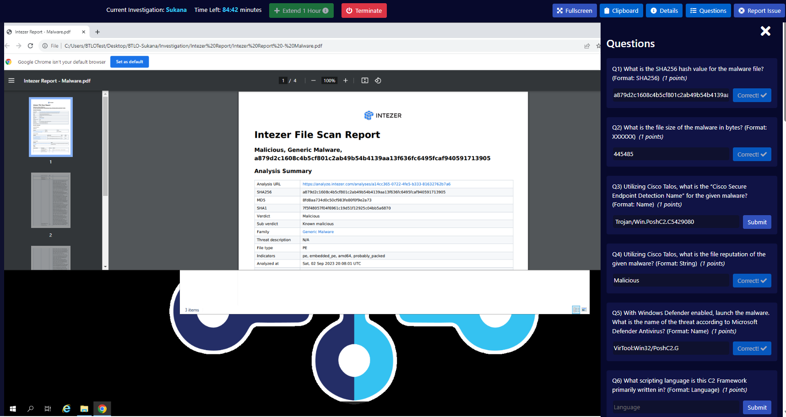

---

### Q2 — File Size of the Malware in Bytes

**Method:** Searched the SHA256 hash on VirusTotal and checked the Details tab. File size was listed at the bottom of the Basic Properties section.

**Answer:** `445485`

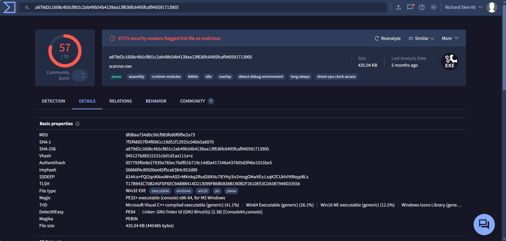

---

### Q3 — Cisco Secure Endpoint Detection Name (Cisco Talos)

**Method:** Searched the SHA256 hash on Cisco Talos Intelligence (talosintelligence.com). The Cisco Secure Endpoint Detection Name was listed in the file reputation results.

**Answer:** `W32.Auto:a879d2.in03.Talos`

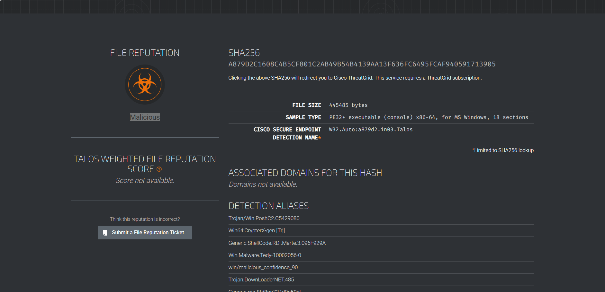

---

### Q4 — File Reputation (Cisco Talos)

**Method:** Same Cisco Talos lookup as Q3. The file reputation is displayed prominently on the left side of the results.

**Answer:** `Malicious`

---

### Q5 — Microsoft Defender Antivirus Threat Name

**Method:** On VirusTotal's Detection tab, scrolled through the vendor list and found the Microsoft entry.

**Answer:** `VirTool:Win32/PoshC2.G`

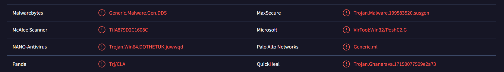

---

### Q6 — Primary Scripting Language of the C2 Framework

**Method:** The detection names across multiple vendors reference PoshC2 — a post-exploitation C2 framework. Research confirmed that while PoshC2 uses PowerShell for its implants/agents, the core backend of the framework itself is written in Python 3. The question asks what the framework is primarily written in, not what language it deploys to targets.

**Answer:** `Python`

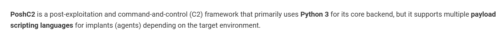

---

### Q7 — Sending Email Address

**Method:** Located the `TurnOffAV&Run.eml` file in the Investigation folder and opened it in Notepad to read the raw headers. The `From` header showed the sender's full address.

**Answer:** `secretsociety2023@protonmail.com`

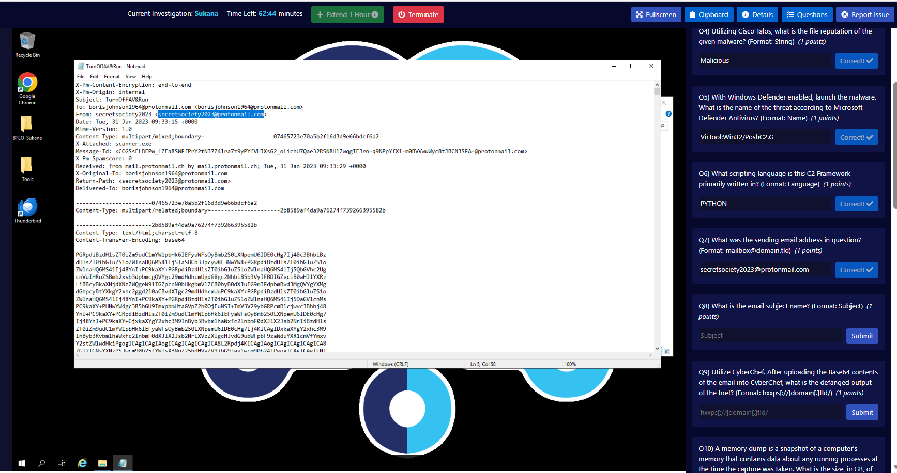

---

### Q8 — Email Subject

**Method:** Same raw email file. The `Subject` header was visible near the top of the file.

**Answer:** `TurnOffAV&Run`

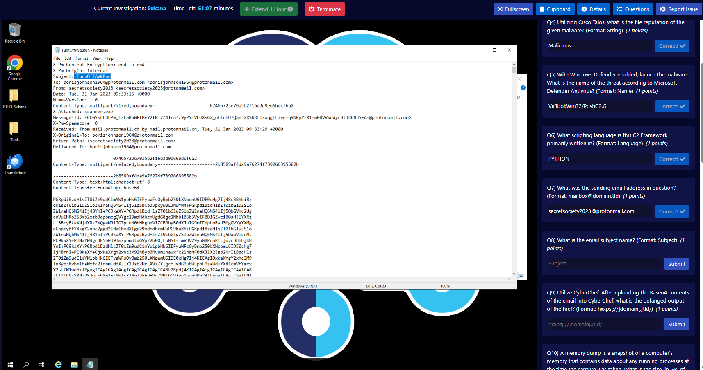

---

### Q9 — Defanged Output of the href in the Email Body

**Method:** The email body is Base64 encoded — visible in the raw email under the `Content-Transfer-Encoding: base64` header. Copied the Base64 block into CyberChef and applied **From Base64** to decode it. The output was HTML containing the email content. The only `href` present was in the Proton Mail signature footer: `href="https://proton.me/"`.

Copied just the URL, pasted into a fresh CyberChef input, and applied **Defang URL** with all options checked to convert it to the safe sharing format.

**Answer:** `hxxps[://]proton[.]me/`

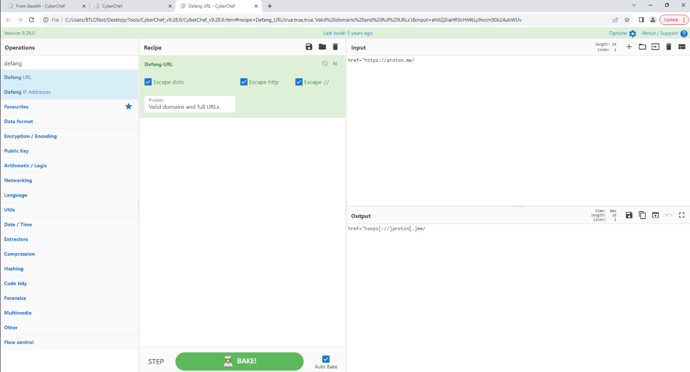

---

### Q10 — Size of the Memory Dump in GB

**Method:** Right-clicked `VictimMemory.raw` in Windows Explorer and checked Properties. The file size showed `5,368,709,120 bytes`. Windows displays this as 5.00 GB (using binary GiB calculation), but the question asks for GB in decimal:

5,368,709,120 ÷ 1,000,000,000 = **5.37 GB**

A common trap — Windows uses binary (divides by 1,073,741,824) which gives 5.00, not the decimal GB the question wants.

**Answer:** `5.37`

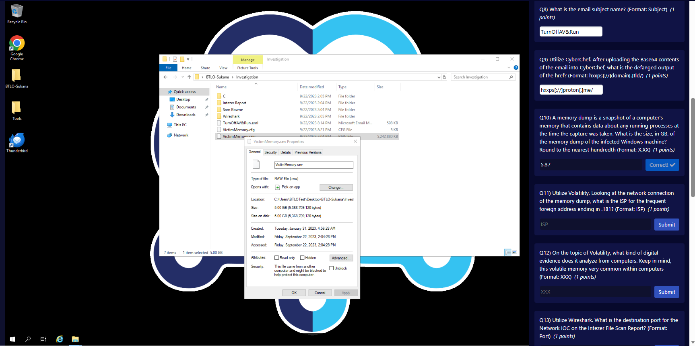

---

### Q11 — ISP for the Foreign Address Ending in .181

**Method:** Ran Volatility against the memory dump to get network connections:

```
.\vol.exe -f VictimMemory.raw windows.netscan.NetScan
```

The output showed a foreign address of `52.184.212.181`. Looked this IP up on DomainTools — the WHOIS data confirmed it belongs to Microsoft Corporation.

**Answer:** `Microsoft`

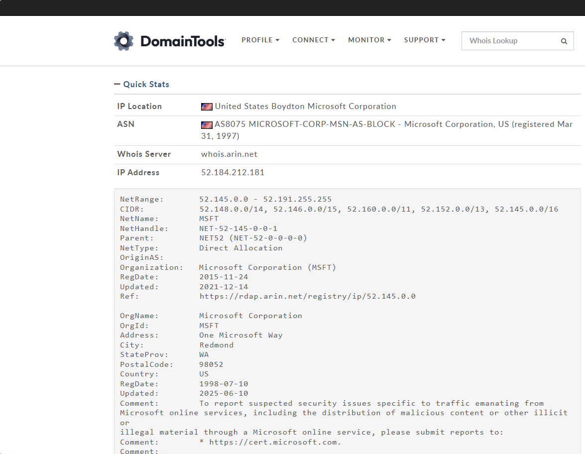

---

### Q12 — Type of Digital Evidence Volatility Analyses

**Method:** Knowledge-based. Volatility is a memory forensics tool — it analyses RAM dumps (volatile memory).

**Answer:** `RAM`

---

### Q13 — Destination Port for the Network IOC from the Intezer Report

**Method:** The Intezer report listed a Network IOC with a destination IP of `13.42.49.148`. Opened the Wireshark capture from the Investigation folder and filtered for that IP:

```
ip.addr == 13.42.49.148
```

The TCP layer of the matching packets showed Destination Port: 443.

**Answer:** `443`

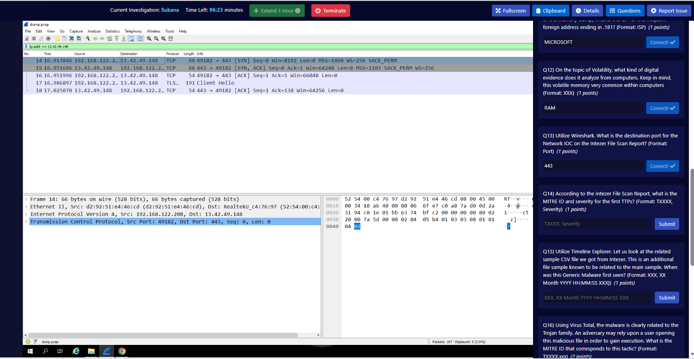

---

### Q14 — MITRE ID and Severity for the First TTP in the Intezer Report

**Method:** Opened the Intezer report and navigated to the TTPs section. The first technique listed described process injection behaviour. Googled the description to identify the correct MITRE ID — T1055 (Process Injection). The Intezer report listed its severity as High.

**Key learning:** The format hint `TXXXX, Severity` means parent technique only — no sub-technique needed. Adding `.002` would have been wrong here even though the specific sub-technique was identifiable.

**Answer:** `T1055, High`

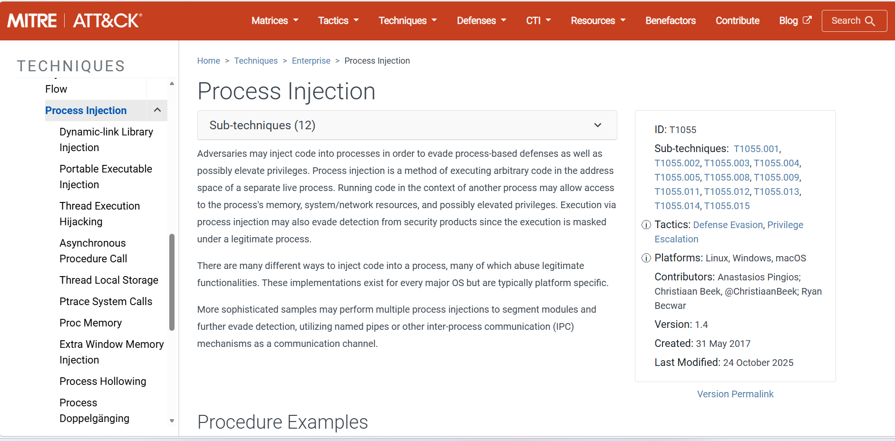

---

### Q15 — When Was the Related Sample First Seen

**Method:** The Intezer report included a related samples CSV file. Opened it in Timeline Explorer. The CSV contained one entry with a "First Seen" timestamp in the first column.

**Answer:** `Fri, 08 May 2020 02:39:58 GMT`

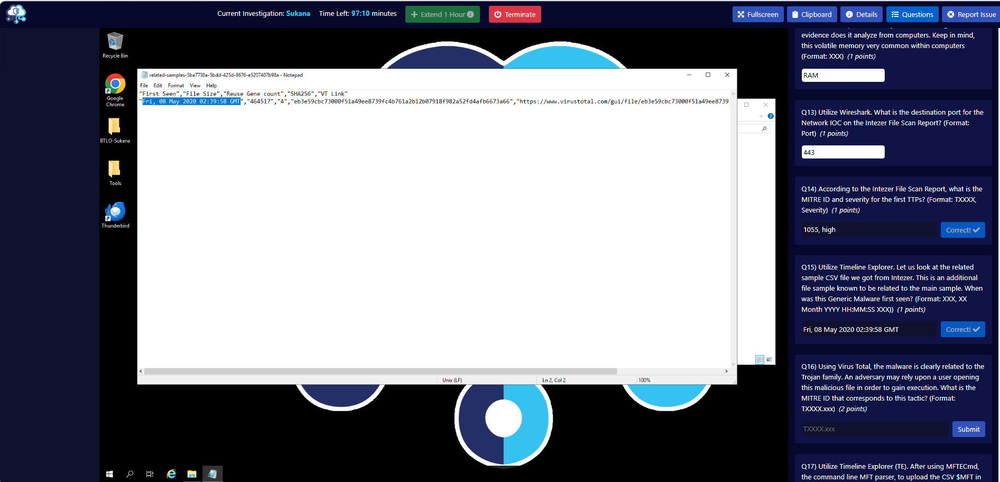

---

### Q16 — MITRE ID for User Opening a Malicious File to Gain Execution

**Method:** The question describes a social engineering technique where a user is tricked into opening a malicious file. Searched MITRE ATT&CK for this behaviour — T1204 (User Execution), sub-technique T1204.002 (Malicious File). The format hint `TXXXX.xxx` confirmed a sub-technique was needed this time.

**Answer:** `T1204.002`

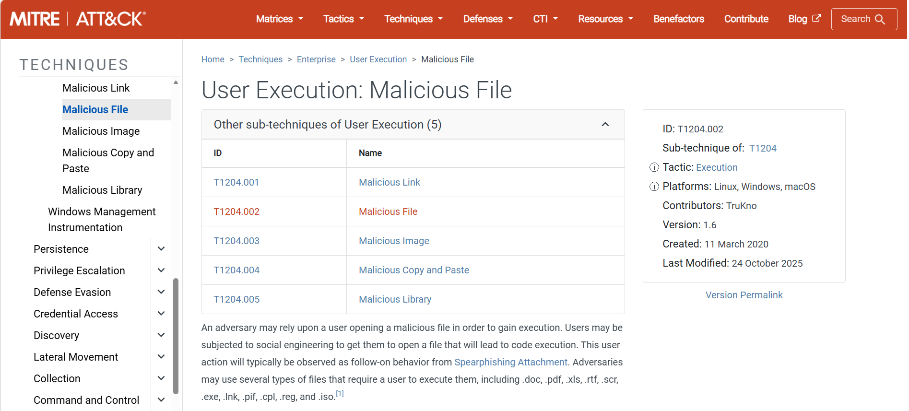

---

### Q17 — FileName (FN) (0x10) Creation Timestamp for the Malware File

**Method:** Used MFTECmd to parse the Master File Table from the KAPE output:

```
.\MFTECmd.exe -f "C:\Users\BTLOTest\Desktop\BTLO-Sukana\Investigation\C\$MFT" --csv C:\Users\BTLOTest\Desktop
```

Loaded the output CSV into Timeline Explorer and searched for `scanner.exe`. Located the entry and read the **Created0x10** column value — this is the FN (FileName) attribute creation timestamp.

**Answer:** `2023-01-31 09:33:41`

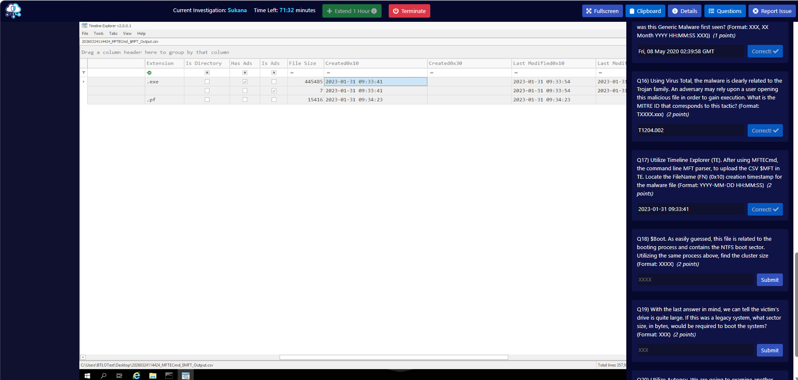

---

### Q18 — Cluster Size from the $Boot File

**Method:** Ran MFTECmd against the $Boot file instead of $MFT:

```
.\MFTECmd.exe -f "C:\Users\BTLOTest\Desktop\BTLO-Sukana\Investigation\C\$Boot" --csv C:\Users\BTLOTest\Desktop
```

The cluster size was printed directly to the CMD output — no need to open the CSV. Output showed: `Cluster size: 4,096`

**Answer:** `4096`

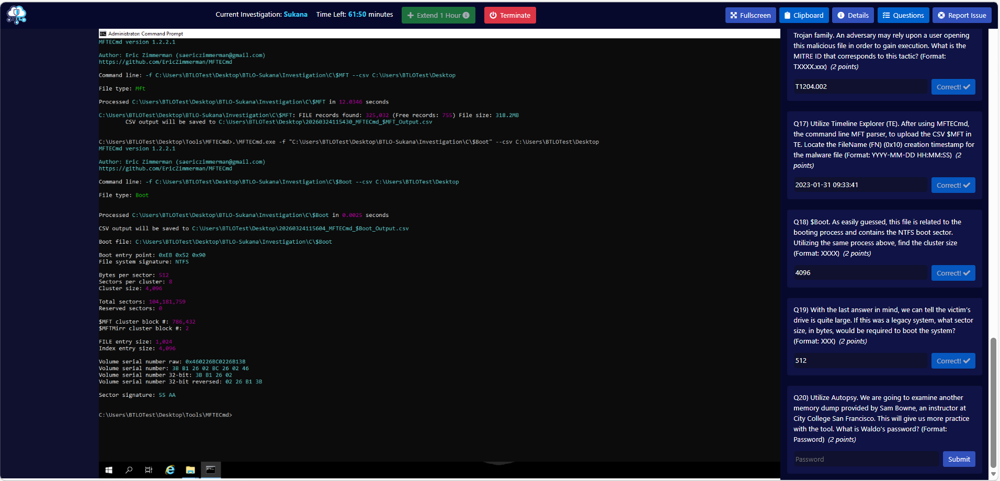

---

### Q19 — Legacy System Sector Size in Bytes

**Method:** Knowledge-based. Legacy systems (pre-Advanced Format drives) used 512-byte sectors. Modern drives use 4096-byte (4K) sectors. The question references the large drive identified in Q18 and asks what sector size a legacy system would have needed.

**Answer:** `512`

---

### Q20 — Waldo's Password

**Method:** Opened Autopsy and created a new case. Added `memdump.mem` from the Sam Bowne folder as a data source. Although Autopsy flagged it couldn't determine the file system type (expected for a raw memory dump), it still carved files and extracted strings. Once ingest completed, ran a keyword search for `waldo`. Results showed carved files containing the string `net user waldo Apple123 /add` — a net user command that reveals the password set for the Waldo account.

**Answer:** `Apple123`

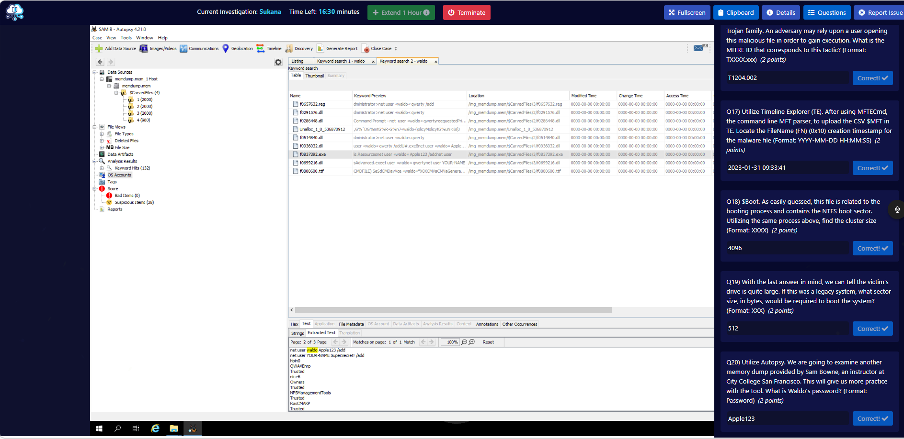

---

## Attack Summary

Putting it all together, this is what happened to the victim:

1. **Phishing email** sent from `secretsociety2023@protonmail.com` with subject `TurnOffAV&Run` — social engineering designed to make the victim disable their AV before running the attachment
2. **Malicious attachment** (`scanner.exe`) — a PoshC2 implant disguised as an AV scanner, 445,485 bytes, flagged by 57/72 vendors on VirusTotal
3. **Execution** — victim ran the file, giving the attacker a foothold (T1204.002)
4. **C2 communication** — malware beaconed out to `13.42.49.148` on port 443 (HTTPS to blend in with normal traffic)
5. **Process injection** — malware used process injection (T1055) to execute within legitimate processes, evading detection

**MITRE ATT&CK Mapping:**

| Technique | ID | Evidence |
|-----------|-----|---------|
| Spearphishing Attachment | T1566.001 | Malicious email with scanner.exe attached |
| User Execution: Malicious File | T1204.002 | Victim ran scanner.exe |
| Process Injection | T1055 | Identified in Intezer TTP analysis — severity: High |
| Application Layer Protocol | T1071 | C2 over HTTPS (port 443) |

---

## Key Techniques and Lessons

**GB vs GiB** — Windows shows file sizes in GiB (binary) but some questions want decimal GB. Always check the format and do the maths: bytes ÷ 1,000,000,000 for GB, bytes ÷ 1,073,741,824 for GiB.

**MITRE format hints matter** — `TXXXX` means parent technique only. `TXXXX.xxx` means sub-technique required. Read the format hint before submitting.

**Base64 email bodies** — phishing emails often encode the HTML body in Base64. The structure in the raw email is: headers → boundary → `Content-Type: text/html` → `Content-Transfer-Encoding: base64` → the encoded block. Only decode that specific block, not the attachment section.

**MFTECmd $Boot output** — cluster size and sector information prints directly to the terminal when parsing $Boot. No need to open the CSV for this one.

**Autopsy with memory dumps** — Autopsy is primarily a disk forensics tool but can still carve useful artefacts from raw memory dumps even when it can't parse the file system. Let it finish ingesting before searching.

**MFTECmd commands used:**

| Command | Purpose |
|---------|---------|
| `.\MFTECmd.exe -f "path\to\$MFT" --csv C:\Output` | Parse Master File Table — file creation timestamps |
| `.\MFTECmd.exe -f "path\to\$Boot" --csv C:\Output` | Parse Boot sector — cluster size, sector info |
