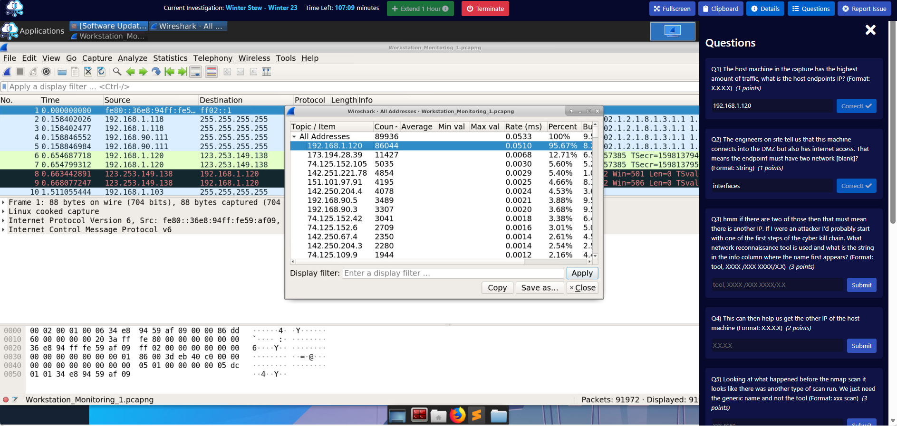
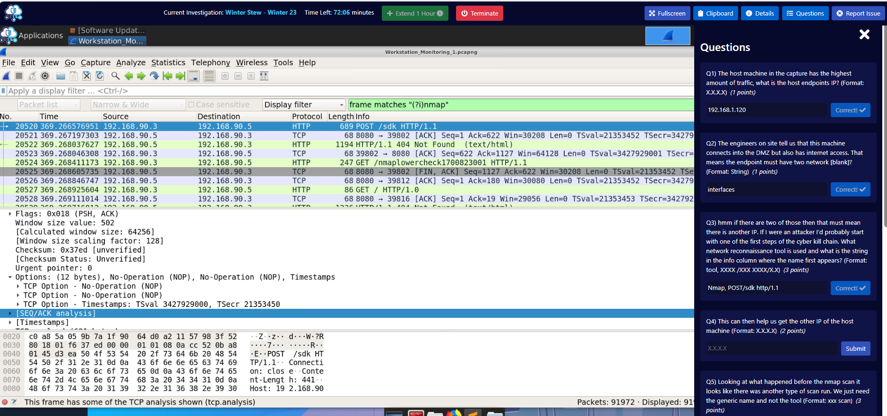
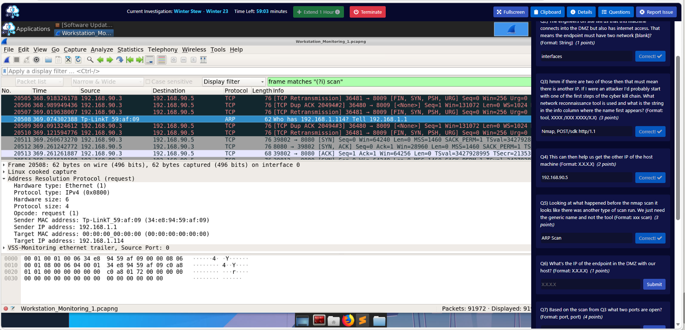
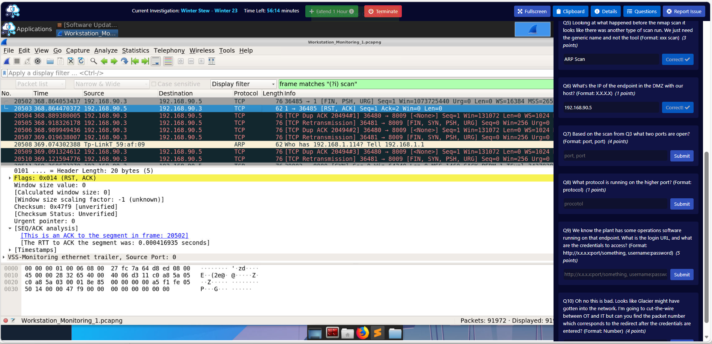
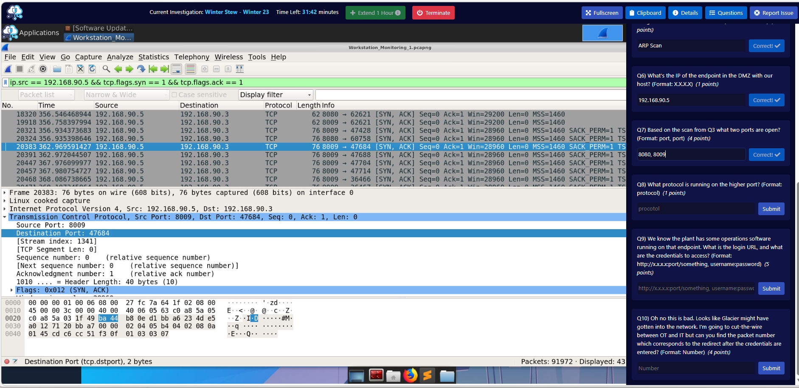
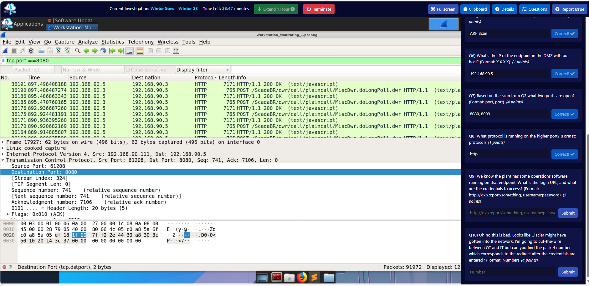
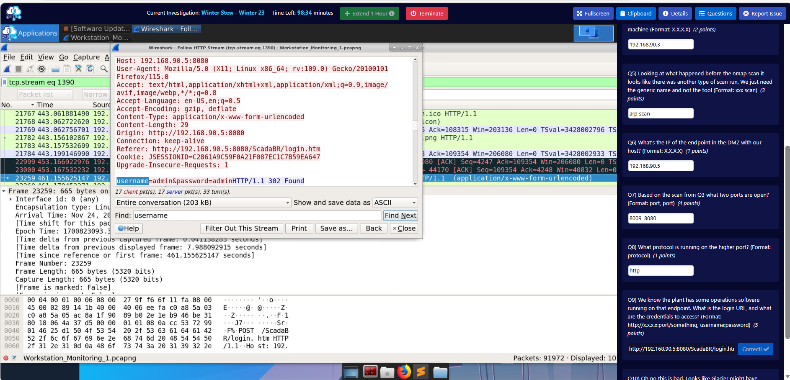
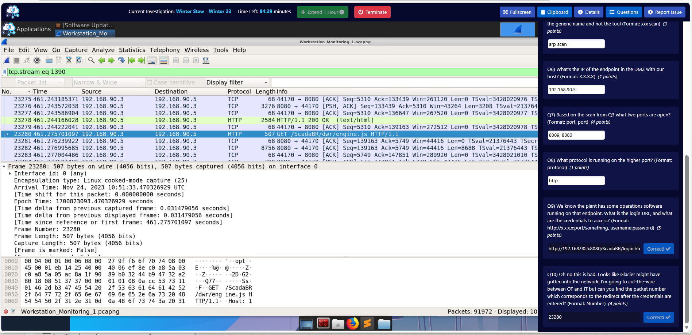

# Winter Stew — BTLO Investigation Writeup

**Platform:** Blue Team Labs Online (BTLO)  
**Lab Type:** Retired Investigation  
**Difficulty:** Easy  
**Category:** Network Analysis  
**Tools Used:** Wireshark  

---

## Scenario

Festiva has many ideas for Winter Wonderland, one of which includes mass manufacturing of stew to make sure everyone is fed over the harsh period of the year. With all the recent issues with Glacier happening, she wants to make sure her Chemical Plant where the stew is getting made is okay. All questions are related to a network capture taken from one of the Monitoring Workstations in the plant's DMZ.

**Evidence file:** `Workstation_Monitoring_1.pcapng`

---

## Investigation

### Q1 — Host Endpoint IP (Highest Traffic)

**Method:** Opened the pcap in Wireshark and navigated to Statistics → Endpoints. Sorted by packet count. The top entry was clearly dominant at 95.67% of all traffic.

**Filter used:** Statistics → Endpoints → IPv4 tab

**Answer:** `192.168.1.120`


---

### Q2 — Two Network Interfaces

**Method:** The endpoints table showed 192.168.1.120 communicating both with internal addresses (192.168.1.x, 192.168.90.x) and external internet IPs (173.194.x.x, 74.125.x.x). This means the machine has two network interfaces — one facing the internal network and one with internet access.

**Answer:** `interfaces`



---

### Q3 — Network Reconnaissance Tool and Info Column String

**Method:** Used a case-insensitive string search across all packet content to find where Nmap first appears:

```
frame matches "(?i)nmap"
```

This returned multiple packets. The first match (packet 20520) showed `POST /sdk HTTP/1.1` in the Info column — this is Nmap's scripting engine making its initial probe. The earlier case-sensitive filter `frame contains "Nmap"` only returned one result and missed lowercase matches — the case-insensitive regex approach is the correct method.

**Key learning:** Always use `frame matches "(?i)keyword"` rather than `frame contains "keyword"` when hunting for strings in Wireshark — the latter is case-sensitive and will miss variations.

**Answer:** `Nmap, POST/sdk http/1.1`



---

### Q4 — Second IP of the Host Machine

**Method:** With the Nmap filter still applied, the traffic showed the scan originating from `192.168.90.3` — this is the DMZ-facing interface of the monitoring workstation (192.168.1.120 being its other interface).

**Answer:** `192.168.90.3`

---

### Q5 — Scan Type Before the Nmap Scan

**Method:** Reasoned that before a port scan, an attacker would typically perform host discovery. Applied a case-insensitive scan search and then scrolled back through early traffic looking for ARP packets. Found ARP broadcast requests (`Who has 192.168.1.114? Tell 192.168.1.1`) being sent out — this is an ARP scan used to identify live hosts on the network before the nmap port scan began.

**Filter used:** `frame matches "(?i)scan"` then reviewed ARP traffic

**Answer:** `ARP Scan`



---

### Q6 — IP of the Endpoint in the DMZ

**Method:** The Nmap scan was directed at a single target. From the traffic already analysed, all scan activity was directed at `192.168.90.5`. This is the SCADA endpoint sitting in the plant's DMZ — confirmed by the earlier endpoints table showing significant traffic between 192.168.90.3 and 192.168.90.5.

**Answer:** `192.168.90.5`



---

### Q7 — Two Open Ports Found by the Scan

**Method:** To find open ports, filtered for SYN-ACK responses coming back from the target — these confirm a port is open and listening.

```
ip.src == 192.168.90.5 && tcp.flags.syn == 1 && tcp.flags.ack == 1
```

This returned 43 packets. Scrolled through the results and found two distinct source ports responding: 8080 and 8009.

**Why SYN-ACK?** When a port is open, the handshake goes:
- Attacker → Target: `SYN` ("is this port open?")
- Target → Attacker: `SYN, ACK` ("yes, come in")
- Attacker → Target: `ACK` ("acknowledged")

Closed ports respond with `RST, ACK` and filtered ports produce no response at all.

**Answer:** `8080, 8009`



---

### Q8 — Protocol Running on the Higher Port (8009)

**Method:** Applied a display filter for port 8080 traffic to examine the application protocol in use:

```
tcp.port == 8080
```

The Protocol column showed HTTP throughout, and the Info column contained ScadaBR-related URLs confirming a web application. The higher port (8009) is the standard Apache Tomcat AJP connector port, but Wireshark labelled the traffic as HTTP.

**Answer:** `http`



---

### Q9 — Login URL and Credentials

**Method:** The HTTP traffic on port 8080 revealed POST requests to ScadaBR — an open-source SCADA/HMI platform. Filtered for POST requests to isolate the login attempt:

```
http.request.method == "POST" && ip.addr == 192.168.90.5
```

Located packet 23259: `POST /ScadaBR/login.htm HTTP/1.1`. Right-clicked → Follow → HTTP Stream. The stream showed the POST body in red (client-sent data):

```
username=admin&password=admin
```

Default credentials had not been changed on the SCADA system.

**Why Follow Stream?** The packet list only shows a one-line summary per packet. The actual content — headers, POST body, credentials — lives inside the packet. Following the stream reassembles the full conversation into readable text rather than requiring manual inspection of raw packet fields.

In the HTTP stream window, **red text** = data sent by the client (attacker), **blue text** = data returned by the server.

**Answer:** `http://192.168.90.5:8080/ScadaBR/login.htm, admin:admin`



---

### Q10 — Packet Number of the Post-Login Redirect

**Method:** After the login POST, the server would respond with a redirect (HTTP 302) to send the authenticated user to the main application. Scrolled down through the stream packets and looked at the Info column for a redirect response. Packet 23280 showed a GET to `/ScadaBR/dwr/engine.js` — the first request made after successful authentication, confirming this is where the redirect landed.

**Answer:** `23280`



---

## Attack Summary

The capture shows a staged attack against a Chemical Plant SCADA system:

1. **ARP Scan** — Attacker discovers live hosts on the DMZ subnet
2. **Nmap Port Scan** — Ports 8080 and 8009 identified as open on 192.168.90.5
3. **Nmap NSE Probing** — Scripting engine fingerprints the web service on port 8080, identifies ScadaBR
4. **Credential Access** — Attacker logs into the ScadaBR interface using default credentials (`admin:admin`)
5. **Authenticated Access** — Session established, attacker has full access to the plant's SCADA/HMI system

**MITRE ATT&CK Mapping:**

| Technique | ID | Evidence |
|-----------|-----|---------|
| Network Service Discovery | T1046 | Nmap port scan against 192.168.90.5 |
| Valid Accounts — Default Accounts | T1078.001 | admin:admin credentials accepted |
| Exploit Public-Facing Application | T1190 | ScadaBR accessible from DMZ |

---

## Key Wireshark Techniques Used

| Technique | Filter / Method |
|-----------|----------------|
| Find all instances of a string (case-insensitive) | `frame matches "(?i)keyword"` |
| Identify open ports from a scan | `ip.src == TARGET && tcp.flags.syn == 1 && tcp.flags.ack == 1` |
| Find HTTP POST login requests | `http.request.method == "POST" && ip.addr == X.X.X.X` |
| Read full conversation content | Right-click packet → Follow → HTTP Stream |
| Overview of all traffic by host | Statistics → Endpoints |
| Overview of protocols in capture | Statistics → Protocol Hierarchy |
